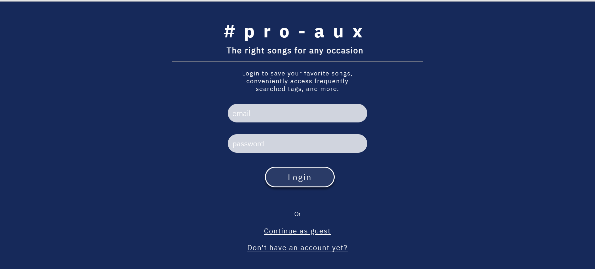
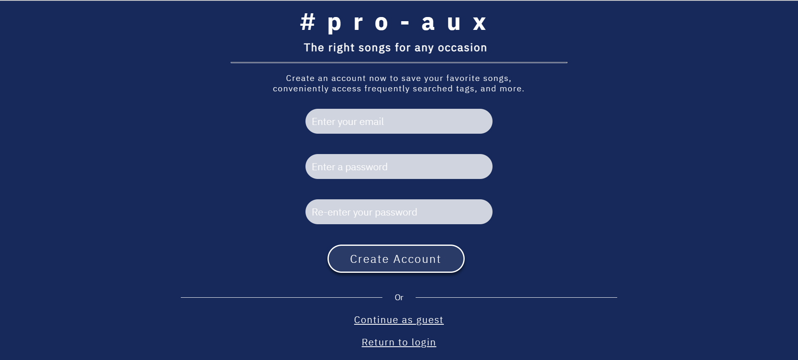

# Link to web app: https://pro-aux-369817.ue.r.appspot.com/
# Link to backend deployment: https://persuasive-axe-370203.ue.r.appspot.com/

# #pro-aux

## *If logout button does not work, try inputting the command 
```
npm install react-router-dom --save
```

## Introduction/ Background
**#pro-aux** is a web application that recommending songs. User will first login to access the searching page. If user does not have an account, they can either sign up with their email address, or continue as a guest to access.\
When user navigates to the search page, they will first asked to pick a genre they are interested, then the app will generate some playlists for the user. User will then choose a playlist they are interested. When the user presses the search button, songs of that playlist will be displayed. User can click on the button of a specific song to see the name of the song, the artist, and the image of that album cover.

## Motivation
Music recommendation is a very useful feature that has been widely used in everyone’s life. While sometimes it is hard to discover new favorites, getting a list of music by specifying a genre can be very helpful. Also, this application will need both API calls and deployment, which is a great practice of what we have learned in this semester.

## Project Scope
**Music searching app**\
filter to find playlists and songs based on tags you like.\
**Landing page**\
login/create an account, or continue as guest.\
Account holders get special features, like being able to save the songs they like, and access frequently searched tags.\
**Search page**\
Select a genre and a playlist, press search to access a wide array of songs matching the specified inputs.\
Account page to see user information.\
Logout to return to landing page.

## Project Management
Using Github as a version control.\
Using Unit Test to make progress step by step.\
Meet basic requirements before the due day:\
Program runs.\
Backend and frontend both deployed.
1. Landing Page: Can let users create an account and use that account to login at next time.
2. Search Page: Can do basic choice of genres and playlist, will display the resulting song lists.

Have as more extra features as possible before the due day:
1. User’s account info page complete.
2. Album cover image display.
3. Album info display.
4. Able to play part of the song.
5. Have a track of the user's searching history.


## Literature Review
**Inspirations:**\
**-Spotify Web Player:** similar in that on the Spotify Web Player, we can browse playlists created based on different genres. \
**-Shazam app:** we took inspiration from Shazam's incredible function that allows you to discover new music. We wanted to create an equally useful app that would help expand our users' music tastes.\
**-LocationSearch app:** we liked the functionality of the locationSearch app and wanted to create an app that would produce similar results, but with a different purpose. We also stepped up our game with a better UI and more features.\

## Software Technologies
**Backend:** Java\
**Frontend:** HTML, CSS, Node.JS\
**Cloud Technology:** Google Cloud Platform\
**Project Management:** Github, Google Spreadsheet, GroupMe\
**Testing Technology:** TSL Generator\
**Database:** Google Firebase

## Project Lifecycle
**Agile Method**\
Carefully planned each step, especially early stages.\
Carefully designed UI prototypes, researched and learned unfamiliar technologies before attempting implementation (Spotify API, Angular).\
First created working frontend with react, then incorporated backend work.\
Frequent testing after every element added (regression).\
**Scrum process**\
Product Owner: N/A - essentially ourselves & our plan.\
Scrum Master: Addy.\
Scrum team: all.\
Sprint planning: plan what we need to accomplish by each week, biweekly check-ins.


## Requirements


## Design 


## Testing 
### Blackbox
**Selenium IDE**\
Used multiple flows to test.\
Made sure each button worked.\
Groupmates working on another feature performed testing on a specific feature to minimize knowledge of internal code structure.
### Whitebox
**JUnit Testing**\
Correct Return Values from Database.\
Username, genre, songs.\
Postman Testing: API Calls \
Note: POST Mappings are used whenever a request body is needed since Angular does not allow request body for GET\
POST Mapping to /users/setEmail\
-Body: email (string)\
-sets the email of the currently logged-in user (used to track who is logged in)\
GET Mapping to /users/getEmail\
-returns the email of the currently logged-in user ("null" if logged in as guest)\
POST Mapping to /users/match-credentials\
-Body: {email (string), password (string)}\
-Checks if the par of credentials exists and is associated with an account\
POST Mapping to /users/new-user\
-Body: {email (string), password (string)}\
-Creates a new entry with the user's information in the database\


## UI




# Getting Started with Create React App

This project was bootstrapped with [Create React App](https://github.com/facebook/create-react-app).

## Available Scripts

In the project directory, you can run:

### `npm start`

Runs the app in the development mode.\
Open [http://localhost:3000](http://localhost:3000) to view it in your browser.

The page will reload when you make changes.\
You may also see any lint errors in the console.

### `npm test`

Launches the test runner in the interactive watch mode.\
See the section about [running tests](https://facebook.github.io/create-react-app/docs/running-tests) for more information.

### `npm run build`

Builds the app for production to the `build` folder.\
It correctly bundles React in production mode and optimizes the build for the best performance.

The build is minified and the filenames include the hashes.\
Your app is ready to be deployed!

See the section about [deployment](https://facebook.github.io/create-react-app/docs/deployment) for more information.

### `npm run eject`

**Note: this is a one-way operation. Once you `eject`, you can't go back!**

If you aren't satisfied with the build tool and configuration choices, you can `eject` at any time. This command will remove the single build dependency from your project.

Instead, it will copy all the configuration files and the transitive dependencies (webpack, Babel, ESLint, etc) right into your project so you have full control over them. All of the commands except `eject` will still work, but they will point to the copied scripts so you can tweak them. At this point you're on your own.

You don't have to ever use `eject`. The curated feature set is suitable for small and middle deployments, and you shouldn't feel obligated to use this feature. However we understand that this tool wouldn't be useful if you couldn't customize it when you are ready for it.

## Learn More

You can learn more in the [Create React App documentation](https://facebook.github.io/create-react-app/docs/getting-started).

To learn React, check out the [React documentation](https://reactjs.org/).

### Code Splitting

This section has moved here: [https://facebook.github.io/create-react-app/docs/code-splitting](https://facebook.github.io/create-react-app/docs/code-splitting)

### Analyzing the Bundle Size

This section has moved here: [https://facebook.github.io/create-react-app/docs/analyzing-the-bundle-size](https://facebook.github.io/create-react-app/docs/analyzing-the-bundle-size)

### Making a Progressive Web App

This section has moved here: [https://facebook.github.io/create-react-app/docs/making-a-progressive-web-app](https://facebook.github.io/create-react-app/docs/making-a-progressive-web-app)

### Advanced Configuration

This section has moved here: [https://facebook.github.io/create-react-app/docs/advanced-configuration](https://facebook.github.io/create-react-app/docs/advanced-configuration)

### Deployment

This section has moved here: [https://facebook.github.io/create-react-app/docs/deployment](https://facebook.github.io/create-react-app/docs/deployment)

### `npm run build` fails to minify

This section has moved here: [https://facebook.github.io/create-react-app/docs/troubleshooting#npm-run-build-fails-to-minify](https://facebook.github.io/create-react-app/docs/troubleshooting#npm-run-build-fails-to-minify)


